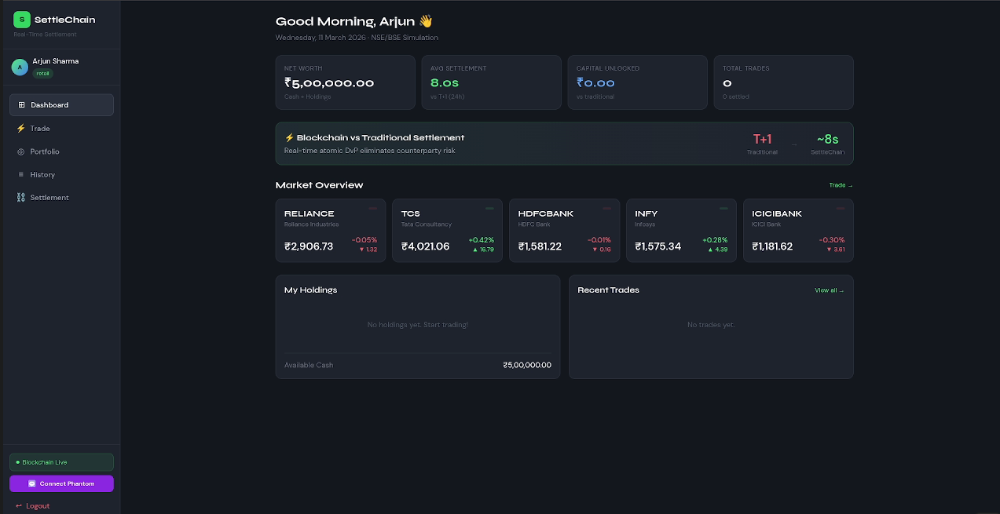
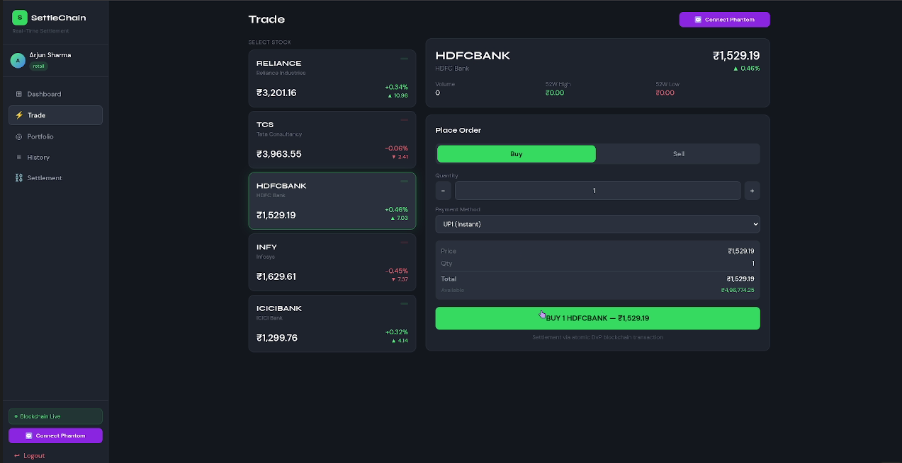
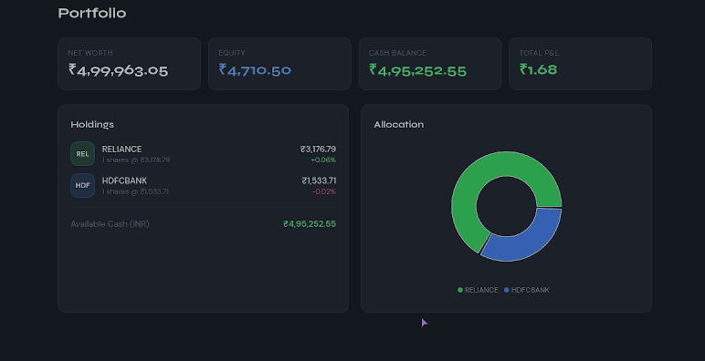

# SettleChain -- Real-Time Blockchain Settlement for Indian Stock Markets

SettleChain is a prototype project that demonstrates how blockchain can
improve settlement in stock markets. In traditional trading systems,
settlements usually happen in a **T+1 cycle**, where the transfer of
shares and money takes place one day after the trade.

This project explores how blockchain can enable **near-instant
settlement (around 5--10 seconds)** using the concept of **atomic
Delivery vs Payment (DvP)**. The system simulates a trading platform
where tokenized shares and digital INR tokens are exchanged through
smart contracts.


## How to Run

Install dependencies:

```bash
# root
npm i

# frontend
cd frontend
npm i

# backend
cd ../backend
npm i
```

Start the local blockchain (run from root):

```bash
npx hardhat node
```

Start the backend (new terminal):

```bash
cd backend
npm run start
```

Start the frontend (another terminal):

```bash
cd frontend
npm run start
```

------------------------------------------------------------------------

## Trading Dashboard


# Tech Stack

The project is built as a full-stack system consisting of a frontend
interface, a backend API, and a blockchain settlement layer.

The **frontend** is built using React and Tailwind CSS. It provides the
trading dashboard, portfolio view, and settlement tracker.

The **backend** uses Node.js with Express. It manages API requests,
authentication, order processing, and interaction with the blockchain.

The **blockchain layer** uses Solidity smart contracts deployed on a
local Ethereum network using Hardhat. The backend communicates with
these contracts using ethers.js.

**Technologies used**

-   React + Tailwind CSS\
-   Node.js + Express\
-   Solidity Smart Contracts\
-   Hardhat (Local Ethereum Network)\
-   ethers.js\
-   Git / GitHub

------------------------------------------------------------------------

# Architecture

The system follows a simple **client--server architecture with a
blockchain layer**.

    React Frontend
          │
          │ REST API
          ▼
    Node.js + Express Backend
          │
          │ ethers.js
          ▼
    Hardhat Local Blockchain
    (Smart Contracts for INR Token, Stock Tokens, and Settlement)

The React frontend allows users to interact with the system. When a user
places a trade, the request is sent to the backend API.

The backend validates the trade, simulates payment processing, and then
calls the smart contracts using ethers.js.

The smart contracts perform the **atomic DvP settlement**, ensuring that
payment and share transfer happen together in the same blockchain
transaction.

------------------------------------------------------------------------

### Trade Interface


# Data Pipeline

The data flow begins when a user places a trade through the frontend
trading interface.

The frontend sends the trade request to the backend using a REST API.
The backend verifies the request, checks ownership of shares, and
processes a simulated payment.

Once validation is completed, the backend interacts with the settlement
smart contract. The contract performs an **atomic swap**, transferring
stock tokens to the buyer and payment tokens to the seller within the
same transaction.

After the blockchain confirms the transaction, the backend updates the
system state and sends the settlement result back to the frontend.

------------------------------------------------------------------------


## Portfolio View


------------------------------------------------------------------------

# Note

This project is a prototype built for demonstration and learning
purposes. Many components such as payments and order matching are
simplified and are not intended for production use.
